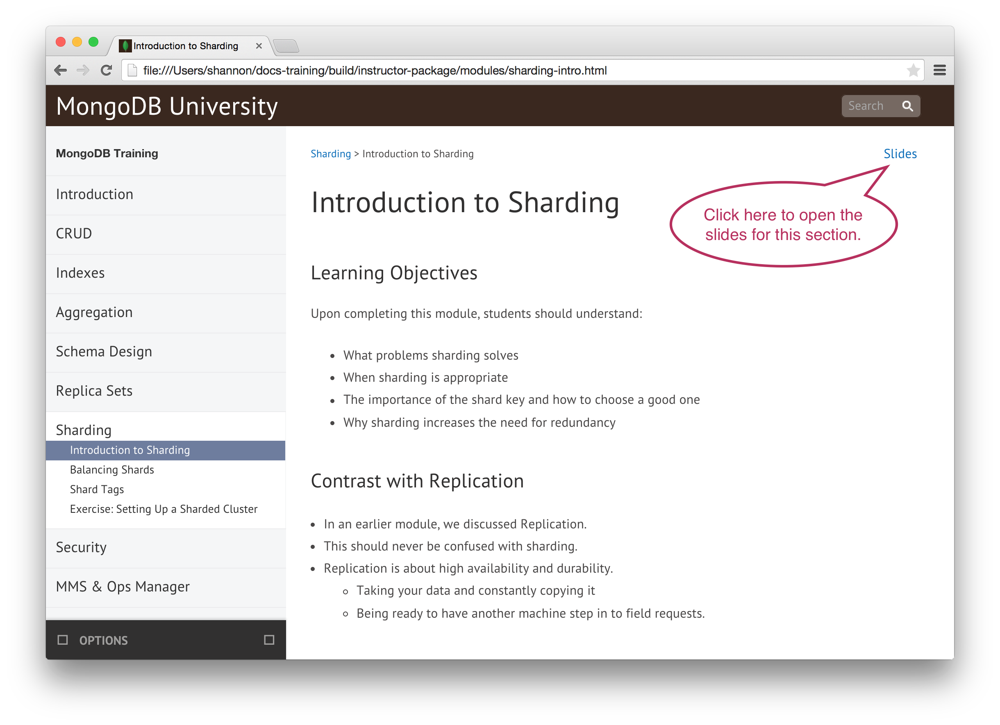
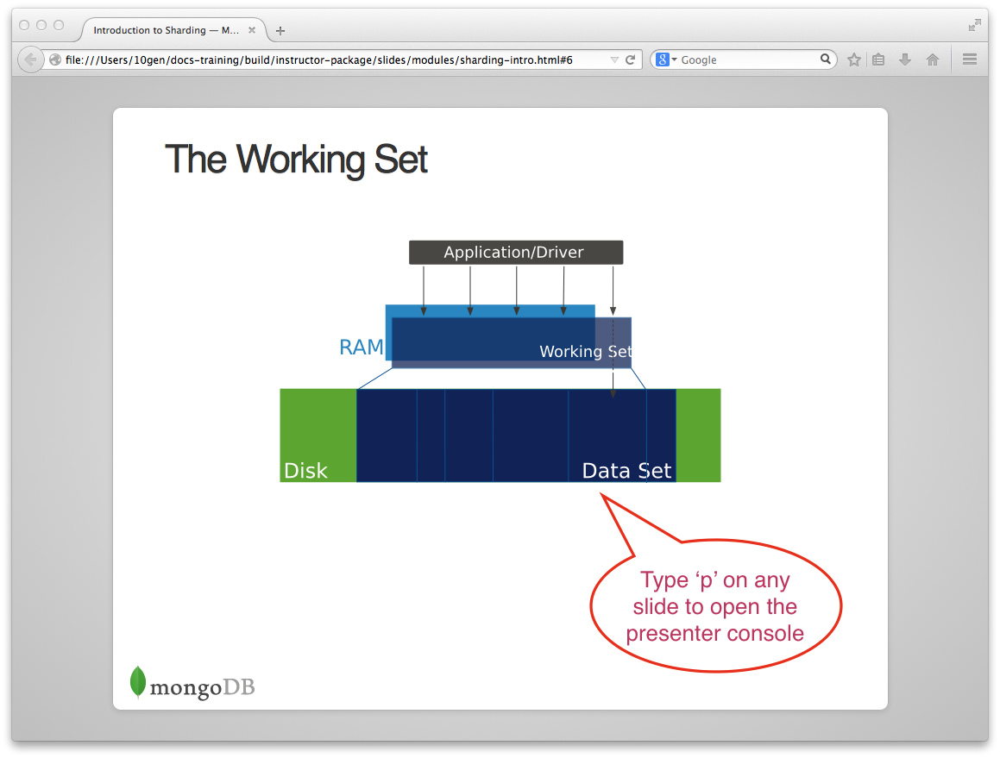

================
MongoDB Training
================

Overview
--------

This repository contains the MongoDB training materials used for the following classes:

-  MongoDB Essentials Training
-  MongoDB Developer Training
-  MongoDB Admin Training

Instructor and student materials are in the `presentation-3.2`_ directory of the repo. See the `Using Instructor Materials`_ section below.

Objectives
----------

-  To support instructors in learning and delivering MongoDB trainings by providing:

   -  A easily-navigated instructor guide.

   -  Slides, exercises, and presenter notes for delivery in class

   -  A workbook enabling students to follow lessons and exercises and take notes

-  Well-maintained training resources that encourage contributions from instructors

-  Modular materials for greater flexibility in how trainings are
   organized

Using Instructor Materials
--------------------------

Instructor materials are provided in `presentation-3.2/instructor-package.tar.gz`_. As an instructor you will primarily use:

- The Instructor Guide
- Slides
- The Presenter Console
- Datasets (see `presentation-3.2/usb_drive.zip`_)

See below for examples of each.

The Instructor Guide
--------------------

Unzip the instructor package and open instructor-package/index.html to see the instructor guide.

Slides
------

To view slides for a particular module, for example, Sharding > Introduction to Sharding, navigate to that module in the instructor guide and click the slides link in the upper right corner.

The Presenter Console
---------------------

.. figure:: https://s3.amazonaws.com/edu-static.mongodb.com/training/images/presenter_console_annotated.png
   :alt: Presenter Console

Status
------

These materials are updated for MongoDB 3.0 and used for MongoDB instructor-led training. Sections include:

-  Introduction
-  CRUD
-  Indexes
-  Aggregation
-  Drivers
-  Schema Design
-  Advanced Schema Design
-  Application Engineering
-  Replica Sets
-  Sharding
-  Security
-  Cloud & Ops Manager
-  Performance Troubleshooting
-  Backup and Recovery

.. _presentation : presentation

.. _presentation/instructor-package.tar.gz : presentation/instructor-package.tar.gz
